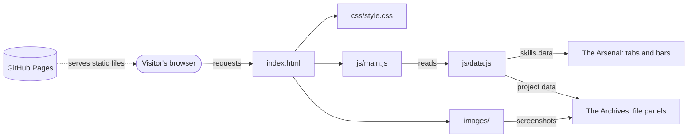
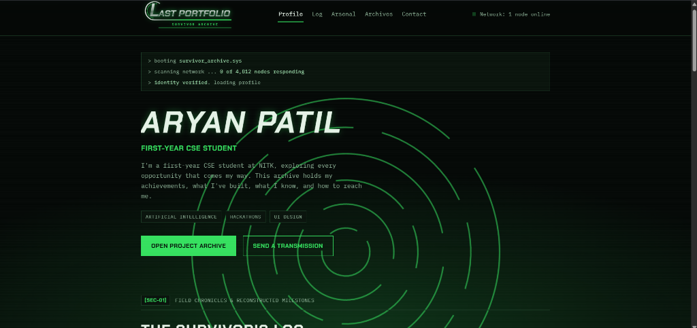

<h1 align="center">Last Portfolio</h1>

<p align="center">
  
</p>

<p align="center">
  <b>A Doomsday-themed personal portfolio, built as a digital survival archive.</b><br>
  <b>One survivor. One archive. Everything I have built.</b>
</p>

---

<details>
<summary><h2>Table of Contents</h2></summary>

- [Architecture Diagram](#architecture-diagram)

- [The Problem](#the-problem)
- [Our Solution](#our-solution)
- [What runs on the server side?](#what-runs-on-the-server-side)
- [Design System and How It Works](#design-system-and-how-it-works)
  - [1. Visual identity](#1-visual-identity)
  - [2. Data-driven sections](#2-data-driven-sections)
  - [3. Boot sequence and glitch effect](#3-boot-sequence-and-glitch-effect)
  - [4. Rotating maze background](#4-rotating-maze-background)
  - [Tech stack](#tech-stack)
- [Installation & Setup Guide](#installation--setup-guide)
  - [1. Check the prerequisites](#1-check-the-prerequisites)
  - [2. Clone the repository](#2-clone-the-repository)
  - [3. Run it locally](#3-run-it-locally)
  - [4. Add your own details](#4-add-your-own-details)
  - [5. Add project screenshots](#5-add-project-screenshots)
- [Deployment](#deployment)
- [Project Structure](#project-structure)
- [Team Members](#team-members)
- [License](#license)

</details>

---

## Architecture Diagram

Last Portfolio is a static site. The browser downloads three kinds of files, and a small script builds the skills and project sections from a data file.



<p align="center">
  
</p>


**Live site:** [https://aryanatul2008-ship-it.github.io/Silicon-maze-last-portfolio/](https://aryanatul2008-ship-it.github.io/Silicon-maze-last-portfolio/)

## The Problem

Most student portfolios are a resume turned into a webpage: a list of skills and a list of links, with nothing to show who the person actually is. The *Silicon Maze: Doomsday Edition* challenge asked for something different. The portfolio had to feel like a personal digital identity, follow a Doomsday theme, and still read as a professional portfolio.

Three things make this hard:

- **Theme versus clarity.** A heavy theme can bury the content a visitor came for.
- **Honest presentation.** Skills and projects need to be shown clearly, without overstating what the author knows.
- **Different screens.** The site has to work on a phone as well as a laptop.

## Our Solution

Last Portfolio treats the whole site as a **survivor's archive** that is still running after the network has gone down. Each section has a place in that story, so the site reads as one experience and not a pile of separate parts.

| Challenge task | Section | What it contains |
| --- | --- | --- |
| Survivor Profile | **Profile** and **The Survivor's Log** | Name, role, intro, interests, and a timeline of education, goals, achievements and hobbies |
| The Arsenal | **Skills** | Skills grouped into tabs, each with a confidence bar and a short note |
| The Archives | **Projects** | Project "files" with a screenshot, description, tech tags, an expandable list of what it does, and repo links |
| The Doomsday Interface | **Whole site** | Terminal boot sequence, rotating maze background, glitch effect, status indicator, responsive layout |
| The Final Transmission | **Contact** | Email, GitHub and LinkedIn, deployed on a public URL |

### Projects featured

| Project | What it is |
| --- | --- |
| **Aroha** | A learning-to-hiring platform with an AI study roadmap, a live coding arena and job matching based on proven skills |
| **Witness** | A privacy-first proof-of-existence tool that encrypts evidence on the user's device and anchors its hash on a blockchain |

## What runs on the server side?

**Nothing.** There is no backend, database, login or tracking.

- Every file is static HTML, CSS, JavaScript and images, served as-is by the host.
- Skills and projects are stored in `js/data.js` and rendered in the visitor's browser.
- The contact section uses plain links (`mailto:`, GitHub and LinkedIn), so no form data is collected.
- The only outside requests are the Google Fonts stylesheet and the links a visitor chooses to click.

## Design System and How It Works

### 1. Visual identity

The look follows the *Silicon Maze: Doomsday Edition* poster: black and green, metallic silver lettering, and a circular maze.

| Token | Value | Used for |
| --- | --- | --- |
| `--ash` | `#040806` | Page background |
| `--panel` | `#09130c` | Cards and panels |
| `--line` | `#1b3a25` | Thin borders |
| `--bone` | `#e4f2e6` | Main text |
| `--dim` | `#84a68d` | Secondary text |
| `--flare` | `#35e05f` | Main green accent |
| `--ok` | `#9ad8a8` | Pale green highlights |

- **Fonts:** Chakra Petch for headings and IBM Plex Mono for body text, both from Google Fonts.
- **Logo:** an inline SVG with a large italic first letter, an arc that flows into a green line, and a tagline between two lines, inspired by the event title.

### 2. Data-driven sections

Skills and projects live in `js/data.js`. `js/main.js` reads that file and builds the cards, so adding a project means editing data and not the layout.

- **Skills:** each category is a tab. Clicking one re-renders its cards, and the bars animate to their level with a CSS transition.
- **Projects:** each project is a "file" panel. The "Open file" button toggles a class that shows or hides the details, and updates `aria-expanded` for accessibility.

### 3. Boot sequence and glitch effect

When the page loads, a terminal box prints a few lines one at a time using `setTimeout`. When it finishes, a CSS class gives the name a short glitch, built from two offset copies of the text on `::before` and `::after`. With `prefers-reduced-motion` on, the lines show instantly and the glitch is skipped.

### 4. Rotating maze background

The maze is a fixed, non-interactive layer made of six concentric SVG circles with different `stroke-dasharray` patterns. CSS `@keyframes` rotate each ring forever, alternating direction and slowing towards the outside. The layer sits behind the content, and the animation stops under `prefers-reduced-motion`.

### Tech stack

| Layer | Technology |
| --- | --- |
| Structure | HTML5 |
| Styling and animation | CSS3 (variables, Grid, Flexbox, keyframes) |
| Behaviour | Vanilla JavaScript (no frameworks, no build step) |
| Graphics | Inline SVG |
| Fonts | Google Fonts |
| Navigation highlight | `IntersectionObserver` |
| Hosting | GitHub Pages |
| Tools used | VS Code, Git and GitHub, Antigravity (AI coding assistant) |

## Installation & Setup Guide

### 1. Check the prerequisites

There is no build step. You need:

- A modern browser such as Chrome, Edge or Firefox.
- [Git](https://git-scm.com/) to clone the repository.
- *(Optional)* Python 3 or the VS Code **Live Server** extension, if you want to run a local server.

### 2. Clone the repository

```bash
git clone https://github.com/aryanatul2008-ship-it/YOUR-REPO-NAME.git
cd YOUR-REPO-NAME
```

### 3. Run it locally

**Option A: open the file.** Double-click `index.html`.

**Option B: use a local server (recommended).**

```bash
python -m http.server 8000
```

Then open `http://localhost:8000` in your browser.

**Option C: VS Code.** Install the *Live Server* extension, right-click `index.html`, and choose **Open with Live Server**.

### 4. Add your own details

- **Name, role, intro, log entries and contact links:** edit `index.html`.
- **Skills and projects:** edit `js/data.js`.
- **Colours:** change the variables at the top of `css/style.css`.

Search the project for `YOUR` to find any placeholder you have not replaced.

### 5. Add project screenshots

1. Create an `images/` folder next to `index.html` if it does not exist.
2. Save each screenshot there, for example `images/aroha.png` and `images/witness.png`.
3. Make sure the file names in `js/data.js` match exactly, including capital letters and the extension.

## Deployment

The site is hosted on **GitHub Pages**.

1. Push the project to a GitHub repository, with `index.html` in the root folder.
2. On GitHub, open **Settings**, then **Pages**.
3. Under **Build and deployment**, choose **Deploy from a branch**.
4. Select the `main` branch and the `/ (root)` folder, then click **Save**.
5. After a minute or two, the public URL appears at the top of the Pages screen.

Open that URL in a private window and on a phone to check that every image and link works.

**Other hosts:** the same folder also works on Vercel and Netlify. Import the repository and leave the build command empty.

## Project Structure

```
.
├── index.html          # Page structure and static content
├── css/
│   └── style.css       # Design tokens, layout, animations
├── js/
│   ├── main.js         # Nav highlight, boot sequence, tabs, project panels
│   └── data.js         # Skills and projects data
├── images/             # Logo, screenshots and project images
├── README.md
└── LICENSE
```

## Team Members

| Name | Role | Links |
| --- | --- | --- |
| **Aryan Patil** | Design and development | [GitHub](https://github.com/aryanatul2008-ship-it) |
| **Prathamesh Shete** | Team member | [GitHub](https://github.com/Omega131) |

Built for the *Silicon Maze: Doomsday Edition* challenge. Aryan Patil is a first-year B.Tech CSE student at NITK.

## License

This project is licensed under the MIT License. See the [LICENSE](LICENSE) file for details.
